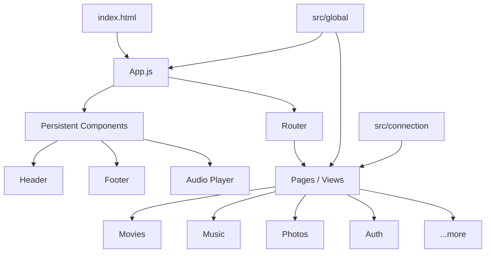

# MediaHUB — Your Personal Media Vault

A premium, self-hosted media server frontend designed for seamless streaming and management of your personal media collection. Built with high performance and "vanilla" simplicity in mind.


---

## Features

- **Centralized Hub**: Unified dashboard for Movies, Music, Videos, Photos, and Documents.
- **Responsive Design**: Fully responsive UI with a sleek dark mode and smooth transitions.
- **Advanced Streaming**: Support for HLS streaming and direct playback with progress tracking.
- **Music Player**: Persistent audio player with playlist support and background playback.
- **Photo & Doc Viewer**: Integrated viewers for images and documents.
- **Secure Access**: Built-in authentication (Login/Signup) with JWT token management.
- **Global Search**: Quickly find any media item across all categories.
- **Management**: Upload, delete, and organize media through an intuitive modal interface.

---

## Technology Stack

- **Core**: Vanilla JavaScript (ES Modules)
- **Styling**: [Tailwind CSS](https://tailwindcss.com/)
- **Icons**: Custom SVG icons
- **Build**: Standalone Tailwind CLI (No Node.js/NPM required for development)

---

## Architecture

MediaHUB-UI follows a **Modular Single-Page Application (SPA)** architecture. It avoids the overhead of heavy frameworks by using a functional component-init pattern.

### Core Structure


### Component Lifecycle
Each view or component is an object returning:
- `html`: A string of HTML (template literal).
- `init()`: An optional function to bind event listeners and fetch data after the HTML is injected into the DOM.

---

## Directory Overview

- `App.js`: Application entry point and router.
- `index.html`: Main HTML template.
- `view/`: All UI components and page views.
  - `pages/`: Full-page layouts (Movies, Music, Player, etc.).
  - `components/`: Reusable UI elements (MediaCards, Modals, Header).
  - `templates/`: Static HTML snippets for dynamic injection.
- `src/`: Core logic and utilities.
  - `connection/`: API health and connection status logic.
  - `global/`: Configuration and HTTP client (`api.js`).
  - `utils/`: Helpers for formatting, auth, and theme management.
- `assets/`: Compiled CSS and static resources.

---

## Getting Started

### 1. Prerequisites
The MediaHUB-UI is designed to be served as static content by the **MediaHUB Backend** (Go). Ensure your backend is configured to point to this directory for static file serving(just copy the whole UI folder and paste it in the backend directory).

### 2. Configuration
Before deploying, update the API base URL to point to your MediaHUB backend:
1. Open `src/global/config.js`.
2. Update the `API_BASE_URL` property:
   ```javascript
   export const CONFIG = {
       API_BASE_URL: "http://your-backend-ip:9123/api",
       // ...
   };
   ```

### 3. Deployment
The MediaHUB-UI is served directly by the **MediaHUB Backend** (Go). To deploy:
1. Ensure your Go backend's static file handler is configured to point to this directory.
2. The backend will automatically serve `index.html` as the entry point and provide API access.

---

## Styling & Customization

The project uses Tailwind CSS(version 4.2+). To modify styles:
- Edit `input.css` or the classes within `.js` components.

### Build Scripts For Linux and macOS
- Run the build script to regenerate the production CSS:
   ```bash
   ./tailwindBuild.sh
   ```
   *Note: This script uses the `./tailwindcss` binary. Which is not included in the project. Please download it from [tailwindcss.com](https://github.com/tailwindlabs/tailwindcss/releases) based on your OS and architecture. And place it in the root directory of the project.*
   *Note: The script is written in bash, so it will only work on Linux and macOS.*
   *Note: The script is not tested on Windows.*

- Run the below script to watch for changes in the input.css file and regenerate the output.css file.
   ```bash
   ./tailwindcss -i ./input.css -o ./assets/output.css --watch
   ```
### Build Scripts For Windows
- Please download the binary as advised in the Linux and macOS section. And place it in the root directory of the project. 
- Rename the binary to `tailwindcss.exe`.
- Open powershell in the mediahub-ui directory of the project.
- Run the below script to build the output.css file for windows.
   ```bash
   ./tailwindcss.exe -i ./input.css -o ./assets/output.css --watch
   ```
- Run the below script to build the output.css file for windows.
   ```bash
   ./tailwindcss.exe -i ./input.css -o ./assets/output.css --minify
   ```  
   
---

## License
This project is licensed under the MIT License - see the [LICENSE](LICENSE) file for details.